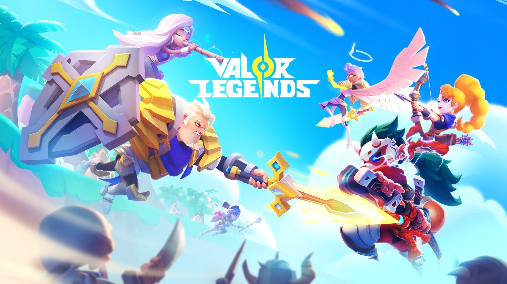

## Valor Legends Info App!
### Webapp showing useful information
#### Lots of stuff missing, feel free to contriboot

And feel free to [check it out here](https://valor.diskpantry.com/)!

#### Running locally:

  1. clone the repo
  2. start a `http server` inside the folder
      - python example: `python -m http.server`
  3. visit `localhost:PORT`, where the port is the one you get from the server
  4. when refreshing, if changes aren't seen, force a browser refresh that deletes the cache since sometimes js tends to do that. for chrome you can just hit `Ctrl + F5`

---

Plan/Stuff to add/Etc.. :

  - Hero
    - [X] Level up
    - [X] Awakening
    - [ ] Breakthrough
    - [ ] Exclusive weapon
  - Gear
    - [X] Gear List
    - [ ] Fill all the list with stats
    - [X] Enhancements/XP
    - [ ] Breakthrough
  - Runes
    - [ ] Runes List
    - [ ] Fill list
    - [ ] Upgrades
    - [ ] Ascensions
  - Guild
    - [ ] Guild Technology
  - Items
    - [ ] Overall list
  - Archive
    - [ ] Oracle Crystal
    - [ ] Forgotten Relics
  - Talisman
    - [ ] List
    - [ ] Upgrades
  - Events
    - [ ] List of events with rewards and all'attt
  - Overall
    - [X] Nicer UI, especially mobile
    - [ ] Images (maybe)
    - [ ] Dark mode

---

### Changelog

2025-10-25:
  - still no automatic solution but full set of items data bellow orange 💪

2025-10-24:
  - realize I can't really keep up with the change log, should find automatic solution

2025-10-15:
  - added more data

2025-10-14:
  - added white gear
  - added more gear filtering
  - new js based menu so I don't gotta copy/paste the same fkahh template and add new menu item on all the pages fuk